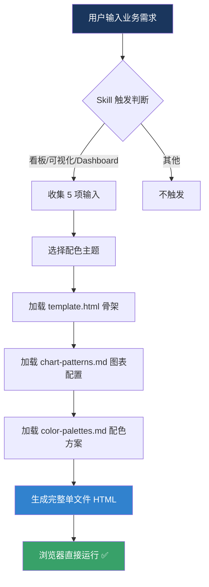

# 🏦 Analysis HTML Dashboard

**一句话生成可视化分析级数据看板/自带智能客服 — 零依赖，开箱即用**

[](https://github.com/YOUR_USERNAME/fintech-html-dashboard)
[](https://opensource.org/licenses/MIT)
[](https://www.codebuddy.cn)
[](https://YOUR_USERNAME.github.io/fintech-html-dashboard/)


> 专为业务/AI产品专家设计的单文件 HTML 仪表板生成器。基于 Trae IDE Skill 架构，快速生成交互式数据可视化页面。


[English](#english) · [中文](#中文)

</div>

---

## 中文

### 🎯 这是什么

**Fintech HTML Dashboard** 是一个 AI Agent Skill，让 AI 助手（WorkBuddy / Claude Code / Cursor 等）能够**一句话生成完整的可视化分析级数据看板页面**。

输出物是一个**单文件 HTML**——复制代码，保存为 `.html`，双击打开，立即可用，自带智能客服基于页面内容问答。

不需要 Node.js，不需要 npm install，不需要任何构建工具。
唯一的外部依赖是 ECharts CDN（自动加载）。

### 🔥 为什么需要它

你有没有遇到过这些场景：

- 😤 花了 2 小时调 ECharts 配置，结果图表还是丑
- 😤 可视化分析看板配色太花哨，老板说"不够专业"
- 😤 用 BI 工具拖了半天，结果导出的页面排版全乱
- 😤 竞品分析要可视化，临时找工具来不及
- 😤 需求文档想做成可交互的 Demo 页，但没人写前端
- 😤 AI时代了分析内容还不能支持自带agent问答
  
**一句话，全解决。**

### ✨ 核心特性

| 特性 | 说明 |
|------|------|
| 🏗️ **强制专业布局** | 左侧边栏导航 + 右侧多页切换，可视化分析 SaaS 标配结构 |
| 📊 **6 种图表模式** | 折线图 / 柱状图 / 饼图 / 雷达图 / 双轴图 / 散点图，自动选型 |
| 🎨 **6 套可视化分析配色** | 深海军蓝 / 森林青 / 皇家紫 / 岩板灰 / 勃艮第红 / 午夜靛蓝 |
| 💬 **智能客服浮窗** | 右下角 AI 客服，关键词匹配自动应答页面内容 |
| 📱 **响应式适配** | 1366px ~ 1920px 桌面端完美呈现 |
| ⚡ **零构建部署** | 单文件 HTML，浏览器直接打开，无需任何构建步骤 |
| 🐂 **署名签名** | 侧边栏底部 "By Abel" 签名，作品归属清晰 |

### 🖼️ 效果展示

<details>
<summary>📸 点击查看生成效果截图</summary>

| 配色主题 | 效果预览 |
|---------|---------|
| 深海军蓝 (默认) |  |
| 森林青 |  |
| 皇家紫 |  |
| 午夜靛蓝 |  |

</details>

### 🚀 快速开始

#### 方式一：WorkBuddy 直接使用（推荐）

```bash
# 在 WorkBuddy 中直接对话
"帮我生成一个AI外呼产品竞品分析看板"
"做一个可视化分析数据可视化页面，用深蓝配色"
"生成竞品对比仪表盘，对比5家公司的技术能力"
```

#### 方式二：手动安装到 WorkBuddy

```bash
# 克隆仓库
git clone https://github.com/YOUR_USERNAME/fintech-html-dashboard.git

# 复制到 WorkBuddy skills 目录
cp -r fintech-html-dashboard ~/.workbuddy/skills/
```

#### 方式三：Claude Code / Cursor 手动配置

```bash
# 克隆到本地
git clone https://github.com/YOUR_USERNAME/fintech-html-dashboard.git

# 将 SKILL.md 和 references/ assets/ 复制到你的 agent 配置目录
```

#### 方式四：直接告诉 AI Agent 安装

复制以下提示词，粘贴给你的 AI 助手：

```
请帮我安装 fintech-html-dashboard skill：
1. 访问 https://github.com/YOUR_USERNAME/fintech-html-dashboard
2. 将 SKILL.md 放到 ~/.workbuddy/skills/html-dashboard/SKILL.md
3. 将 references/ 目录放到 ~/.workbuddy/skills/html-dashboard/references/
4. 将 assets/ 目录放到 ~/.workbuddy/skills/html-dashboard/assets/
5. 安装完成后，测试：说"帮我生成一个可视化分析看板页面"
```
### 😊 示例界面展示


### 📐 架构设计



### 📂 目录结构

```
fintech-html-dashboard/
├── SKILL.md                          # Skill 核心定义（触发规则+结构约束+输出规范）
├── references/
│   ├── chart-patterns.md             # 6 种 ECharts 可视化分析图表配置模板
│   └── color-palettes.md             # 6 套可视化分析级 CSS 配色方案
├── assets/
│   └── template.html                 # 完整 HTML 骨架模板（含侧边栏+图表+客服浮窗）
├── docs/
│   └── index.html                    # GitHub Pages 介绍页
└── README.md                         # 本文件
```

### 🎯 适用场景

| 场景 | 示例提示词 |
|------|-----------|
| 📊 **业务需求调研看板** | "帮我生成一个用户调研数据看板" |
| 📋 **标准化需求文档展示** | "把 PRD 做成可交互的 HTML 页面" |
| ⚔️ **竞品分析可视化** | "生成 AI 外呼产品竞品对比页面" |
| 📈 **市场/行业研究看板** | "做一个可视化分析科技市场趋势仪表盘" |
| 🎪 **产品 Demo 原型** | "帮我做一个 AI 客服产品演示 Demo" |

### 🎨 配色预览

| # | 主题名 | 主色 | 适用场景 |
|---|--------|------|---------|
| 1 | 🌊 深海军蓝 | `#1a365d` → `#3182ce` | 可视化分析、银行、保险（默认推荐） |
| 2 | 🌲 森林青 | `#1a4731` → `#319795` | ESG、绿色可视化分析、环保 |
| 3 | 👑 皇家紫 | `#322659` → `#805ad5` | 高端财富管理、VIP 客户 |
| 4 | 🪨 岩板灰 | `#2d3748` → `#4299e1` | 通用商务、B2B SaaS |
| 5 | 🍷 勃艮第红 | `#742a2a` → `#e53e3e` | 风控、催收、预警系统 |
| 6 | 🌌 午夜靛蓝 | `#1e1b4b` → `#6366f1` | 科技感、AI 产品、大模型 |


### 🔧 技术细节

<details>
<summary>⚙️ 页面结构契约（非协商）</summary>

生成页面必须严格遵守以下结构：

1. **左侧边栏**（固定 240px）：
   - Logo 区 + 导航按钮列表 + 底部署名
   - 点击导航切换右侧内容页
   - 激活态高亮，悬停态过渡

2. **右侧内容区**（flex: 1）：
   - 同一时刻仅显示一个页面
   - 页面切换时隐藏当前页、显示目标页
   - 必须多页 Tab 切换，禁止单页平铺

3. **智能客服浮窗**（右下角 fixed）：
   - 圆形按钮 → 点击展开对话窗口
   - 支持关闭(×)和最小化(−)
   - 关键词匹配自动应答

</details>

<details>
<summary>📊 ECharts 图表选型规则</summary>

| 数据语义 | 图表类型 | ECharts Series |
|---------|---------|----------------|
| 时间序列、趋势变化 | 折线图 | `type: 'line'` |
| 分类对比、排名 | 柱状图 | `type: 'bar'` |
| 占比、百分比构成 | 饼图 | `type: 'pie'` |
| 多维评分 | 雷达图 | `type: 'radar'` |
| 双指标对比 | 双轴图 | 双 yAxis + line+bar |
| 分布模式 | 散点图 | `type: 'scatter'` |

</details>

### 🤝 参与贡献

```bash
# Fork → 修改 → PR
git clone https://github.com/YOUR_USERNAME/fintech-html-dashboard.git
cd fintech-html-dashboard
# 修改后提交 PR
```

欢迎贡献：
- 🎨 新增配色主题
- 📊 新增图表模式
- 💡 新增页面模板
- 🐛 修复问题

### 📜 许可证

[MIT License](LICENSE) — 自由使用、修改、分发。

### 🌟 Star History

[](https://star-history.com/#YOUR_USERNAME/fintech-html-dashboard&Date)

---

## English

### 🎯 What is this

**Fintech HTML Dashboard** is an AI Agent Skill that enables AI assistants to **generate complete financial-grade dashboard pages with a single sentence**.

The output is a **single HTML file** — copy the code, save as `.html`, double-click to open, ready to use.

No Node.js. No npm install. No build tools.
The only external dependency is ECharts CDN (auto-loaded).

### 🔥 Why you need it

- 😤 Spent 2 hours tweaking ECharts config, chart still looks ugly
- 😤 Dashboard colors too flashy, boss says "not professional enough"
- 😤 Need a competitive analysis visualization page, no time for BI tools
- 😤 Want an interactive Demo page for PRD, but no frontend dev available

**One sentence. All solved.**

### ✨ Key Features

| Feature | Description |
|---------|-------------|
| 🏗️ **Professional Layout** | Left sidebar nav + right multi-page switching, standard financial SaaS structure |
| 📊 **6 Chart Patterns** | Line / Bar / Pie / Radar / Dual-axis / Scatter, auto-selection |
| 🎨 **6 Color Themes** | Deep Navy / Forest Teal / Royal Purple / Slate Gray / Burgundy Wine / Midnight Indigo |
| 💬 **Smart CS Widget** | Bottom-right AI customer service, keyword-matched auto-response |
| 📱 **Responsive** | Perfect fit for 1366px ~ 1920px desktop |
| ⚡ **Zero Build** | Single HTML file, open directly in browser |
| 🐂 **Signature** | "By Abel" signature at sidebar bottom |

### 🚀 Quick Start

#### Option 1: Use in WorkBuddy (Recommended)

Just say:
```
"帮我生成一个可视化分析看板页面"
"Create a fintech dashboard with deep navy theme"
```

#### Option 2: Manual Install

```bash
git clone https://github.com/YOUR_USERNAME/fintech-html-dashboard.git
cp -r fintech-html-dashboard ~/.workbuddy/skills/
```

### 🎯 Use Cases

| Scenario | Example Prompt |
|----------|---------------|
| 📊 Business Research Dashboard | "生成用户调研数据看板" |
| 📋 PRD Interactive Display | "把 PRD 做成交互式 HTML 页面" |
| ⚔️ Competitive Analysis | "AI 外呼产品竞品对比可视化" |
| 📈 Market Research | "可视化分析科技市场趋势仪表盘" |
| 🎪 Product Demo | "AI 客服产品演示 Demo" |

### 📜 License

[MIT License](LICENSE)

---

<div align="center">

**如果这个 Skill 对你有帮助，给个 ⭐ Star 吧！**

 Made with 🐂 by [Abel](https://github.com/YOUR_USERNAME)

</div>

